# Jarkom-Modul-5-D11-2023

| Nama                              | NRP        |
| --------------------------------- | ---------- |
| Gracetriana Survinta Septinaputri | 5025211199 |
| Muhammad Rifqi Fadhilah           | 5025211228 |

- [Soal 0](#soal-0)
  - [Topologi](#topologi)
  - [VLSM TREE](#vlsm-tree)
  - [Configuration](#configuration)
- [Soal 1](#soal-1)
- [Soal 2](#soal-2)
- [Soal 3](#soal-3)
- [Soal 4](#soal-4)
- [Soal 5](#soal-5)
- [Soal 6](#soal-6)
- [Soal 7](#soal-7)
- [Soal 8](#soal-8)
- [Soal 9](#soal-9)
- [Soal 10](#soal-10)

## SOAL 0

### Topologi

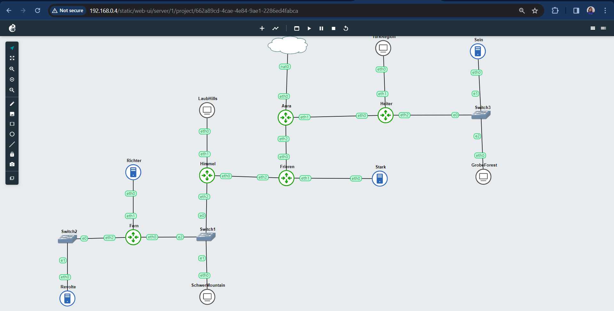

### VLSM TREE

#### Pembagian subnet :

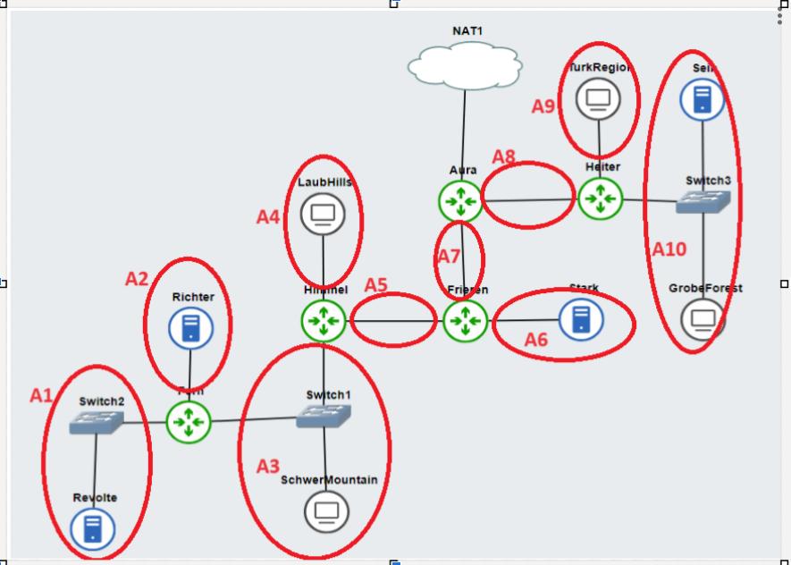

#### Tree :


#### Pembagian IP :

| Nama Subnet | Rute                                    | Network ID  | Netmask         | Broadcast    |
| ----------- | --------------------------------------- | ----------- | --------------- | ------------ |
| A1          | Fern-Switch2-Revolte                    | 10.27.0.0   | 255.255.255.252 | 10.27.0.3    |
| A2          | Fern-Richter                            | 10.27.0.4   | 255.255.255.252 | 10.27.0.7    |
| A3          | Himmel-Switch1-SchwerMountain           | 10.27.0.128 | 255.255.255.128 | 10.27.0.255  |
| A4          | Himmel-LaubHills                        | 10.27.2.0   | 255.255.254.0   | 10.27.3.255  |
| A5          | Frieren-Himmel                          | 10.27.0.8   | 255.255.255.252 | 10.27.0.11   |
| A6          | Frieren-Stark                           | 10.27.0.12  | 255.255.255.252 | 10.27.0.15   |
| A7          | Aura-Frieren                            | 10.27.0.16  | 255.255.255.252 | 10.27.0.19   |
| A8          | Aura-Heiter                             | 10.27.0.20  | 255.255.255.252 | 10.27.0.23   |
| A9          | Heiter-TurkRegion                       | 10.27.8.0   | 255.255.248.0   | 10.27.15.255 |
| A10         | Heiter-Switch3-Sein-Switch3-GrobeForest | 10.27.4.0   | 255.255.252.0   | 10.27.7.255  |

### Configuration

#### STATIC IP

- Aura

```
auto eth0
iface eth0 inet dhcp

auto eth1
iface eth1 inet static
	address 10.27.0.21
	netmask 255.255.255.252

auto eth2
iface eth2 inet static
	address 10.27.0.17
	netmask 255.255.255.252

up route add -net 10.27.8.0 netmask 255.255.248.0 gw 10.27.0.22
up route add -net 10.27.4.0 netmask 255.255.252.0 gw 10.27.0.22
up route add -net 10.27.0.12 netmask 255.255.255.252 gw 10.27.0.18
up route add -net 10.27.0.8 netmask 255.255.255.252 gw 10.27.0.18
up route add -net 10.27.2.0 netmask 255.255.254.0 gw 10.27.0.18
up route add -net 10.27.0.128 netmask 255.255.255.128 gw 10.27.0.18
up route add -net 10.27.0.4 netmask 255.255.255.252 gw 10.27.0.18
up route add -net 10.27.0.0 netmask 255.255.255.252 gw 10.27.0.18
```

- Frieren

```
auto eth0
iface eth0 inet static
	address 10.27.0.18
	netmask 255.255.255.252
	gateway 10.27.0.17

auto eth1
iface eth1 inet static
	address 10.27.0.13
	netmask 255.255.255.252

auto eth2
iface eth2 inet static
	address 10.27.0.9
	netmask 255.255.255.252

up route add -net 10.27.0.128 netmask 255.255.255.128 gw 10.27.0.10
up route add -net 10.27.2.0 netmask 255.255.254.0 gw 10.27.0.10
up route add -net 10.27.0.4 netmask 255.255.255.252 gw 10.27.0.10
up route add -net 10.27.0.0 netmask 255.255.255.252 gw 10.27.0.10
```

- Himmel

```
auto eth0
iface eth0 inet static
	address 10.27.0.10
	netmask 255.255.255.252
	gateway 10.27.0.9

auto eth1
iface eth1 inet static
	address 10.27.2.1
	netmask 255.255.254.0

auto eth2
iface eth2 inet static
	address 10.27.0.129
	netmask 255.255.255.128

up route add -net 10.27.0.4 netmask 255.255.255.252 gw 10.27.0.131
up route add -net 10.27.0.0 netmask 255.255.255.252 gw 10.27.0.131
```

- Fern

```
auto eth0
iface eth0 inet static
	address 10.27.0.131
	netmask 255.255.255.128
	gateway 10.27.0.129

auto eth1
iface eth1 inet static
	address 10.27.0.5
	netmask 255.255.255.252

auto eth2
iface eth2 inet static
	address 10.27.0.1
	netmask 255.255.255.252
```

- Heiter

```
auto eth0
iface eth0 inet static
	address 10.27.0.22
	netmask 255.255.255.252
	gateway 10.27.0.21

auto eth1
iface eth1 inet static
	address 10.27.8.1
	netmask 255.255.248.0

auto eth2
iface eth2 inet static
	address 10.27.4.1
	netmask 255.255.252.0
```

- Sein

```
auto eth0
iface eth0 inet static
	address 10.27.4.2
	netmask 255.255.252.0
	gateway 10.27.4.1
```

- Stark

```
auto eth0
iface eth0 inet static
	address 10.27.0.14
	netmask 255.255.255.252
	gateway 10.27.0.13
```

#### DYNAMIC IP (DHCP)

Untuk subnet yang memiliki node client menggunakan bantuan DHCP untuk pembagian IP. Pada semua node client diatur konfigurasinya seperti berikut

```
auto eth0
iface eth0 inet dhcp
```

Pada DHCP SERVER `Revolte` dilakukan konfigurasi di `.bashrc` untuk mengatur DHCP

- Revolte

```
echo ‘INTERFACESv4="eth0"’ > /etc/default/isc-dhcp-server

echo ‘#A1
subnet 10.27.0.0 netmask 255.255.255.252 {
}

#A2
subnet 10.27.0.4 netmask 255.255.255.252 {
}

#A3
subnet 10.27.0.128 netmask 255.255.255.128 {
    range 10.27.0.132 10.27.0.254;
    option routers 10.27.0.129;
    option broadcast-address 10.27.0.255;
    option domain-name-servers 10.27.0.6;
    default-lease-time 600;
    max-lease-time 7200;
}

#A4
subnet 10.27.2.0 netmask 255.255.254.0 {
    range 10.27.2.3 10.27.3.254;
    option routers 10.27.2.1;
    option broadcast-address 10.27.3.255;
    option domain-name-servers 10.27.0.6;
    default-lease-time 600;
    max-lease-time 7200;
}

#A5
subnet 10.27.0.8 netmask 255.255.255.252 {
}

#A6
subnet 10.27.0.12 netmask 255.255.255.252 {
}

#A7
subnet 10.27.0.16 netmask 255.255.255.252 {
}

#A8
subnet 10.27.0.20 netmask 255.255.255.252 {
}

#A9
subnet 10.27.8.0 netmask 255.255.248.0 {
    range 10.27.8.3 10.27.15.254;
    option routers 10.27.8.1;
    option broadcast-address 10.27.15.255;
    option domain-name-servers 10.27.0.6;
    default-lease-time 600;
    max-lease-time 7200;
}

#A10
subnet 10.27.4.0 netmask 255.255.252.0 {
    range 10.27.4.3 10.27.7.254;
    option routers 10.27.4.1;
    option broadcast-address 10.27.7.255;
    option domain-name-servers 10.27.0.6;
    default-lease-time 600;
    max-lease-time 7200;
}’>  /etc/dhcp/dhcpd.conf

service isc-dhcp-server restart
```

Karena setiap router berperan sebagai DHCP relay, maka lakukan konfigurasi DHCP di `.bashrc` semua router. Berikut adalah contoh konfigurasi pada `Fern`.

```
apt-get update
apt-get install isc-dhcp-relay -y

echo 'SERVERS="10.27.0.2"
INTERFACES="eth0 eth1 eth2"' > /etc/default/isc-dhcp-relay

echo 'net.ipv4.ip_forward=1' > /etc/sysctl.conf

service isc-dhcp-relay restart
```

## SOAL 1

Agar topologi yang kalian buat dapat mengakses keluar, kalian diminta untuk mengkonfigurasi Aura menggunakan iptables, tetapi tidak ingin menggunakan MASQUERADE.

### Answer

Menjalankan shell script yang berisi command

```
ETH0_IP=$(ip -4 addr show eth0 | grep -oP '(?<=inet\s)\d+(\.\d+){3}')

iptables -t nat -A POSTROUTING -o eth0 -j SNAT --to-source $ETH0_IP
```

Berikut penjelasan dari script :

- `ip -4 addr show eth0` : mendapatkan informasi tentang alamat IPv4 yang diassign ke eth0.
- `grep -oP` : mengambil alamat IPv4 dari output.
- `(?<=inet\s)` : memeriksa pola `inet` yang diikuti spasi/whitespaces sebelum alamat IP.
- `\d+` : mewakili segmen pertama dari alamat IP.
- `(\.\d+){3}` : meencari pola dengan titik dan satu atau lebih digit dan diulang tiga kali sehingga mewakili tiga segmen terakhir dari alamat IP.
- `iptables -t nat` : mengonfigurasi aturan packet filter iptables dan mengidentifikasi table NAT.
- `-A POSTROUTING` : menambahkan rules ke POSTROUTING chain.
- `-o eth0` : menentukan outbound network interface sebagai eth0.
- `-j SNAT --to-source $ETH0_IP` : menggunakan rules SNAT yang mengubah alamat IP sumber paket kemudian menentukan alamat IP sumber baru yang nilainya diambil dari variabel `ETH0_IP` sebelumnya.

### Testing

Lakukan `ping google.com` untuk testing apakah topologi sudah bisa akses keluar. Berikut contoh testing yang dilakukan di node `Revolte`


## SOAL 2

Kalian diminta untuk melakukan drop semua TCP dan UDP kecuali port 8080 pada TCP.

### Answer

Pada shell script `nomor2.sh` dijalankan command untuk install dependencies terlebih dahulu

```
echo 'nameserver 192.168.122.1' > /etc/resolv.conf

apt-get update
apt-get install netcat -y
```

Selanjutnya, baru ditambahkan command untuk melakukan drop semua TCP dan UDP kecuali port 8080 pada TCP dengan memanfaatkan `iptables`

```
# kecuali port 8080 pada TCP
iptables -A INPUT -p tcp --dport 8080 -j ACCEPT
```

Command di atas akan ACCEPT (menerima) semua koneksi dari protocol `TCP` dan port tujuan `8080` dan menambahkan rules ke `INPUT` chain.

```
# untuk melakukan drop semua TCP dan UDP
iptables -A INPUT -p tcp -j DROP
iptables -A INPUT -p udp -s 10.27.0.0/20 -j DROP
```

- Command baris pertama akan DROP semua koneksi dari protocol `TCP` dan menambahkannya ke rules `INPUT` chain.
- Command baris kedua akan DROP semua koneksi dari protocol `UDP` dan IP `10.27.0.0` kemudian ditambahkan ke rules `INPUT` chain.

### Testing

Untuk melakukan testing, kita dapat memanfaatkan `netcat` pada `Sein` sebagai `sender` dan `TurkRegion` sebagai `receiver`. Pada sender kita akan mengirimkan sebuah pesan dan lihat di receiver apakah pesan tersebut masuk atau tidak. Command yang digunakan sebagai berikut.

- Sein (sender)

```
nc 10.27.8.3 8080
nc 10.27.8.3 8000
```

Command di atas akan melakukan koneksi ke IP `10.27.8.3` yaitu IP dari `TurkRegion` dan bisa diikuti oleh pesan apa yang akan dikirim ke receiver.

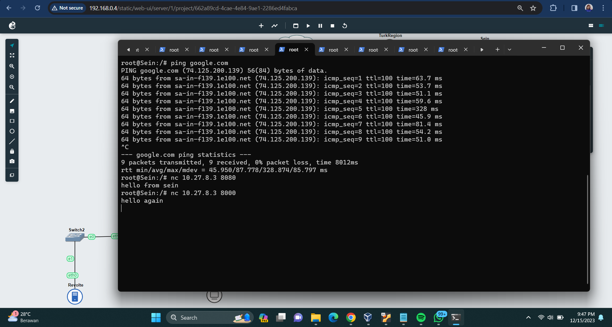

- TurkRegion (receiver)

```
nc -l -p 8080
nc -l -p 8000
```

Command ini akan mendengarkan dari port `8080` dan `8000`

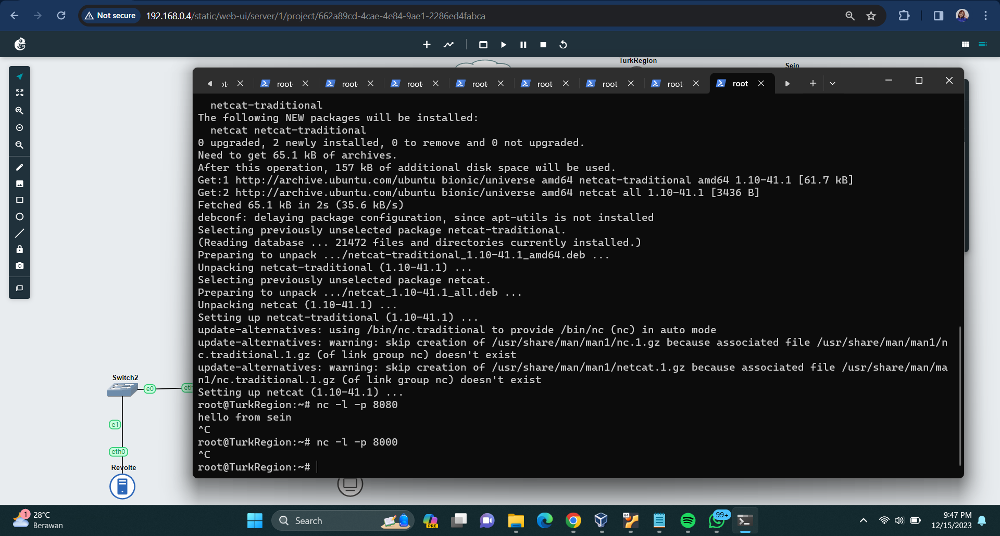

Terlihat pada port `8080` pesan yang dikirim sender masuk karena tadi kita menerima koneksi dari port `8080` dan pada port `8080` tidak muncul pesan apapun karena sebelumnya kita telah mengatur untuk DROP semua koneksi dari protocol `UDP` dan `TCP` yang umumnya berada di port `8000`.

## SOAL 3

Kepala Suku North Area meminta kalian untuk membatasi DHCP dan DNS Server hanya dapat dilakukan ping oleh maksimal 3 device secara bersamaan, selebihnya akan di drop.

### Answer

Pada kedua DHCP dan DNS Server kita tambahkan script yang berisi

```
iptables -A INPUT -m state --state ESTABLISHED,RELATED -j ACCEPT

iptables -A INPUT -p icmp -m connlimit --connlimit-above 3 --connlimit-mask 0 -j DROP
```

Penjelasan :

- Command baris pertama berfungsi untuk `ACCEPT` semua koneksi yang memiliki state `ESTABLISHED` (koneksi yang telah diinisiasi dalam sistem) dan `RELATED` (koneksi yang berkaitan dengan koneksi yang sudah ada) kemudian ditambahkan ke rules `INPUT` chain.
- Command baris kedua akan `DROP` koneksi dari protokol `ICMP` (contohnya ping) jika koneksinya lebih dari 3.

### Testing

Kita dapat melakukan testing dengan melakukan `ping` secara bersamaan dari 4 node ke DHCP atau DNS server. Berikut contoh testing dari keempat client `LaubHills`, `GrobeForest`, `SchwerMountains`, `TurkRegion` ke `Revolte`.

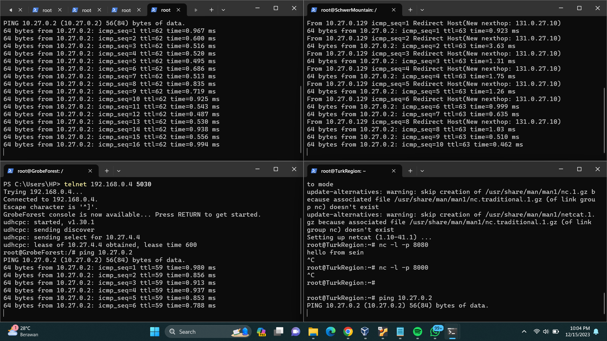

Terlihat bahwa hanya 3 device yang bisa mengirim koneksi dan tersambung dengan `Revolte` sedangkan 1 device ditolak koneksinya karena telah dibatasi.

## SOAL 4

Lakukan pembatasan sehingga koneksi SSH pada Web Server hanya dapat dilakukan oleh masyarakat yang berada pada GrobeForest.

### Answer

Kita akan menjalankan script pada kedua Web Server yaitu `Sein` dan `Stark` yang berisi command sebagai berikut.

```
iptables -A INPUT -p tcp --dport 22 -s 10.27.4.0/22 -j ACCEPT

iptables -A INPUT -p tcp --dport 22 -j DROP
```

Penjelasan :

- Command baris pertama akan `ACCEPT` koneksi dari protocol `TCP` dan IP `10.27.4.0` yang merupakan IP dari subnet GrobeForest serta destination port `22` yang menandakan koneksi SSH (22 adalah default port dari SSH). Setelah itu, rules akan ditambahkan ke `INPUT` chain.
- Command baris kedua akan melakukan `DROP` semua koneksi SSH (port 22) yang bukan berasal dari `GrobeForest`.

### Testing

Testing dapat dilakukan di `GrobeForest` dan node client lain sebagai perbandingan. Kita akan memanfaatkan command `nmap` untuk melihat status koneksi SSH. Berikut merupakan contoh testing dari `GrobeForest` dan `LaubHills` ke Web Server `Sein`

```
nmap 10.27.4.2 22
```

Jangan lupa untuk membuka koneksi port SSH dari sisi Sein terlebih dahulu dengan `netcat`

```
nc -l -p 22
```

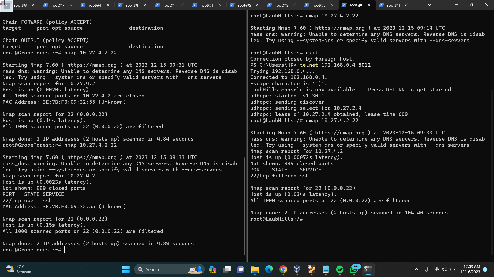

Terlihat pada `GrobeForest` state dari port SSH adalah `open` sedangkan pada `LaubHills` state dari port SSHnya adalah `filtered` yang berarti ditolak.

## SOAL 5

Selain itu, akses menuju WebServer hanya diperbolehkan saat jam kerja yaitu Senin-Jumat pada pukul 08.00-16.00.

### Answer

Melanjutkan dari nomor 4 tadi, kita tambahkan script pada kedua Web Server yang berisi command berikut.

```
iptables -F

iptables -A INPUT -p tcp --dport 22 -s 10.27.4.0/22 -m time --weekdays Mon,Tue,Wed,Thu,Fri --timestart 08:00 --timestop 16:00 -j ACCEPT

iptables -A INPUT -p tcp --dport 22 -j REJECT
```

- `iptables -F` akan menghapus rules `iptables` yang sebelumnya sudah ada.
- Command baris kedua akan `ACCEPT` koneksi dari protocol `TCP` dengan destination port 22 (SSH) dan dari IP subnet `GrobeForest`. Dengan tambahan `-m time --weekdays Mon,Tue,Wed,Thu,Fri --timestart 08:00 --timestop 16:00` yang akan mengatur koneksi yang diterima hanya dari weekdays (Senin-Jumat) dan rentang waktu mulai pukul `08:00` sampai `16:00`.
- Command baris ketiga akan `REJECT` atau menolak semua koneksi SSH yang tidak sesuai rules.

### Testing

Testing menggunakan `nmap` pada `GrobeForest` dan node lain sebagai pembanding. Berikut merupakan testing yang dilakukan pada `GrobeForest` dan `LaubHills` ke `Sein` (jangan lupa untuk membuka port terlebih dahulu dengan netcat) dengan command berikut.

```
nmap 10.27.4.2 22
```

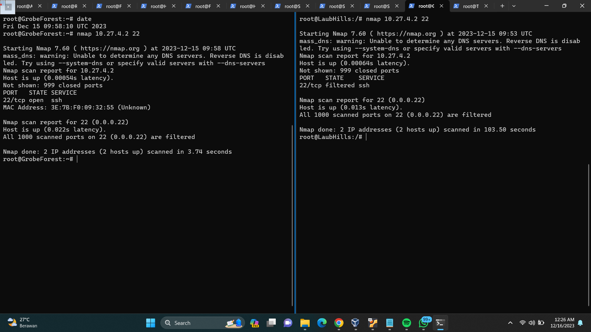

`date` menunjukkan hari Jumat pukul `09:58` (yang mana memenuhi rules) sehingga terlihat pada `GrobeForest` state dari koneksi SSHnya adalah `open`. Sedangkan, pada `LaubHills` state koneksi SSH tetap `filtered` karena tidak memenuhi rules (bukan GrobeForest) meskipun datenya sesuai.

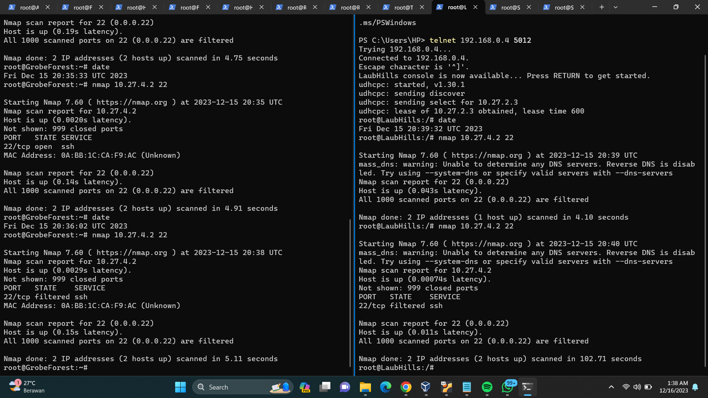

Kita coba mengubah `date` menjadi hari Jumat pukul `20:38`. Terlihat di `GrobeForest` state koneksi sudah `filtered` yang berarti ditolak karena tidak sesuai rules.

## SOAL 6

Lalu, karena ternyata terdapat beberapa waktu di mana network administrator dari WebServer tidak bisa stand by, sehingga perlu ditambahkan rule bahwa akses pada hari Senin - Kamis pada jam 12.00 - 13.00 dilarang (istirahat maksi cuy) dan akses di hari Jumat pada jam 11.00 - 13.00 juga dilarang (maklum, Jumatan rek).

### Answer

Masih lanjutan dari 2 nomor sebelumnya, pada Web Server kita tambahkan script untuk menjalankan command

```
iptables -I INPUT -p tcp --dport 22 -s 10.27.4.0/22 -m time --weekdays Mon,Tue,Wed,Thu --timestart 12:00 --timestop 13:00 -j DROP

iptables -I INPUT -p tcp --dport 22 -s 10.27.4.0/22 -m time --weekdays Fri --timestart 11:00 --timestop 13:00 -j DROP
```

- Command baris pertama mengatur untuk `DROP` koneksi protocol `TCP` dan `SSH` yang dikirim pada hari Senin-Kamis pada pukul `--timestart 12:00 --timestop 13:00`. `iptables -I INPUT` akan menambahkan rules ke `INPUT` chain dengan `-I` berfungsi untuk menaruh rules pada posisi atas.
- Command baris kedua memiliki fungsi yang sama dengan baris pertama, hanya terdapat perbedaan pada `-m time --weekdays Fri --timestart 11:00 --timestop 13:00` yang akan menolak paket pada hari `Jumat` pukul `11:00 - 13:00`

### Testing

Testing dilakukan menggunakan `nmap` dengan mengatur `date` sesuai kebutuhan. Berikut merupakan hasil testing di `GrobeForest` dan `LaubHills`

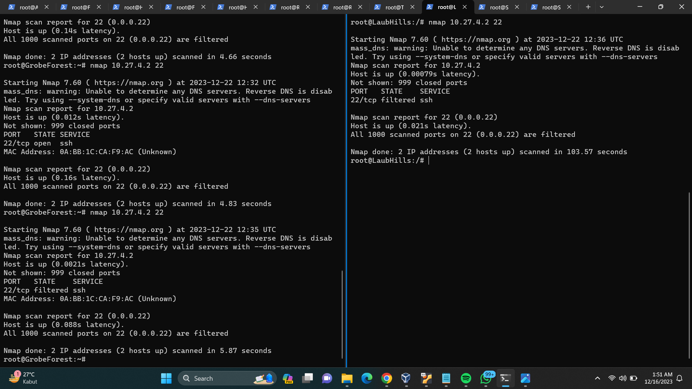

Terlihat pada `GrobeForest` telah diatur datenya menjadi hari `Jumat` pukul `12:35` yang state koneksi SSHnya adalah `filtered` yang berarti `ditolak` karena tidak sesuai rules (hari Jumat pukul 12:35 sedang jumatan). Pada `LaubHills` sudah pasti paket ditolak karena tidak sesuai rules (bukan masyarakat GrobeForest).

## SOAL 7

### Answer

Pada script kita jalankan command

```
iptables -t nat -F

# Akses ke Sein port 80
iptables -A PREROUTING -t nat -p tcp --dport 80 -d 10.27.4.2 -m statistic --mode nth --every 2 --packet 0 -j DNAT --to-destination 10.27.4.2
iptables -A PREROUTING -t nat -p tcp --dport 80 -d 10.27.4.2 -j DNAT --to-destination 10.27.0.14

# Akses ke Stark port 443

iptables -A PREROUTING -t nat -p tcp --dport 443 -d 10.27.0.14 -m statistic --mode nth --every 2 --packet 0 -j DNAT --to-destination 10.27.4.2
iptables -A PREROUTING -t nat -p tcp --dport 443 -d 10.27.0.14 -j DNAT --to-destination 10.27.0.14
```

### Testing

Untuk testing bisa dilakukan salah satunya ketika mengakses port 80, kita menjalankan

- Command `while true; do nc -l -p 80 -c 'echo "ini sein"'; done` di `Sein`
- Command `while true; do nc -l -p 80 -c 'echo "ini stark"'; done` di `Stark`
- Command `nc [IP Web Server] 80` di salah satu client (di sini kami menggunakan `TurkRegion`)

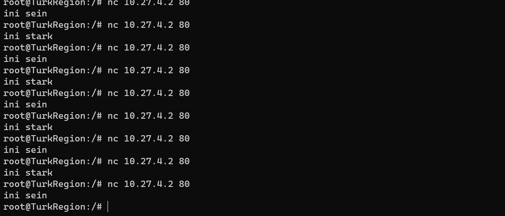

## SOAL 8

Karena berbeda koalisi politik, maka subnet dengan masyarakat yang berada pada Revolte dilarang keras mengakses WebServer hingga masa pencoblosan pemilu kepala suku 2024 berakhir. Masa pemilu (hingga pemungutan dan penghitungan suara selesai) kepala suku bersamaan dengan masa pemilu Presiden dan Wakil Presiden Indonesia 2024.

### Answer

Kita perlu mengatur konfigurasi `iptables` pada script kedua `Web Server` yang berisi command sebagai berikut.

```
REVOLTE_SUBNET="10.27.0.0/30"

masa_pemilu_start=$(date -d "2023-10-19T00:00" +"%Y-%m-%dT%H:%M")

masa_pemilu_end=$(date -d "2024-02-15T00:00" +"%Y-%m-%dT%H:%M")

# IPTABLE masa pemilu
iptables -A INPUT -p tcp -s $REVOLTE_SUBNET --dport 80 -m time --datestart "$masa_pemilu_start" --datestop "$masa_pemilu_end" -j DROP
```

Penjelasan :

- `REVOLTE_SUBNET="10.27.0.0/30"` : membuat variabel yang berisi alamat IP dari subnet `Revolte`.
- `masa_pemilu_start=$(date -d "2023-10-19T00:00" +"%Y-%m-%dT%H:%M")` : membuat variabel yang menyimpan tanggal pemilu dimulai yaitu `19-10-2023` pukul `00:00` dengan format `YEAR-MONTH-DAYHOUR:MINUTES`.
- `masa_pemilu_end=$(date -d "2024-02-15T00:00" +"%Y-%m-%dT%H:%M")` : membuat variabel yang menyimpan tanggal pemilu selesai yaitu `15-02-2024` pukul `00:00` dengan format `YEAR-MONTH-DAYHOUR:MINUTES`.
- Command baris terakhir akan `DROP` koneksi dengan protocol `TCP` dan destination port `80` dari IP subnet `Revolte`. Serta opsi `-m time --datestart "$masa_pemilu_start" --datestop "$masa_pemilu_end"` yang mengatur tanggal mulai dan tanggal selesai sesuai variabel yang telah diatur di atas.

### Testing

Testing menggunakan `nmap` ke `Web Server` dari `Revolte`. Sebelumnya, kita dapat mengatur `date` terlebih dahulu sesuai rentang waktu pemilu agar terlihat state dari koneksi yang telah diatur iptablesnya. Command untuk testing seperti di bawah ini.

```
nmap 10.27.4.2 80
```

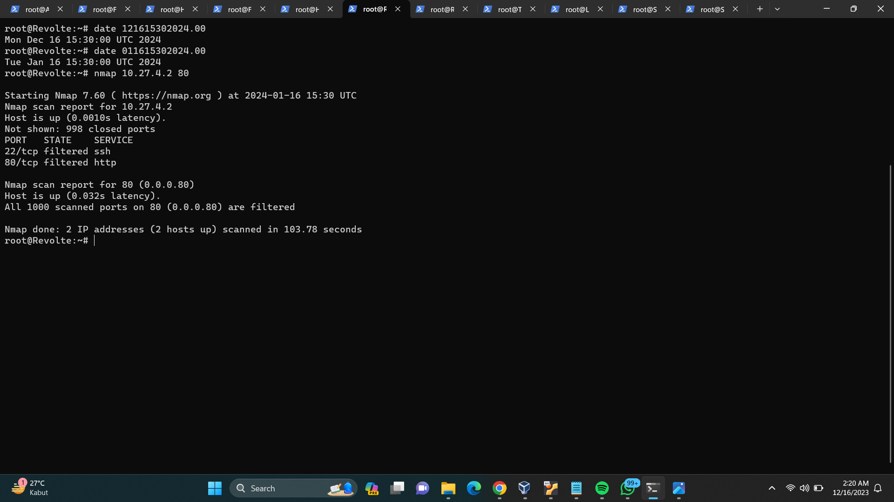

Terlihat state koneksi HTTP atau `port 80` adalah `filtered` karena tanggal dari `Revolte` adalah `16-01-2024` yang mana masih dalam masa pemilu sehingga koneksi `ditolak`.

## SOAL 9

Sadar akan adanya potensial saling serang antar kubu politik, maka WebServer harus dapat secara otomatis memblokir alamat IP yang melakukan scanning port dalam jumlah banyak (maksimal 20 scan port) di dalam selang waktu 10 menit.
(clue: test dengan nmap)

### Answer

Dalam kedua Web Server yaitu `Sein` dan `Stark` jalankan script yang berisi command

```
iptables -N port_scanning

iptables -A INPUT -m recent --name port_scanning --update --seconds 600 --hitcount 20 -j DROP
iptables -A FORWARD -m recent --name port_scanning --update --seconds 600 --hitcount 20 -j DROP

iptables -A INPUT -m recent --name port_scanning --set -j ACCEPT
iptables -A FORWARD -m recent --name port_scanning --set -j ACCEPT
```

Command di atas akan menambahkan rule untuk chain baru `port_scanning` yang membatasi maksimal 20 port dalam selang 10 menit (600 seconds).

### Testing

Testing dengan melakukan ping ke Web Server sebanyak lebih dari 20 untuk melihat apakah port telah dibatasi.

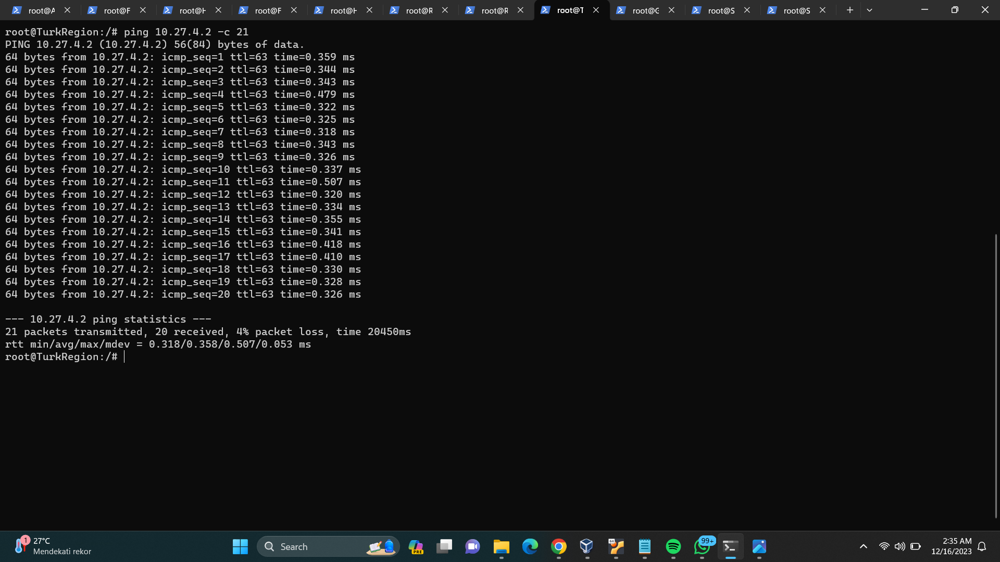

## SOAL 10

Karena kepala suku ingin tau paket apa saja yang di-drop, maka di setiap node server dan router ditambahkan logging paket yang di-drop dengan standard syslog level.

### Answer

Pada tiap node server dan router kita menjalankan script yang berisi

```
iptables -A INPUT  -j LOG --log-level debug --log-prefix 'PACKET_DROP' -m limit --limit 1/second --limit-burst 5
```

Kemudian, kita bisa menggunakan `iptables -L` untuk memeriksa apakah log sudah masuk ke rules.

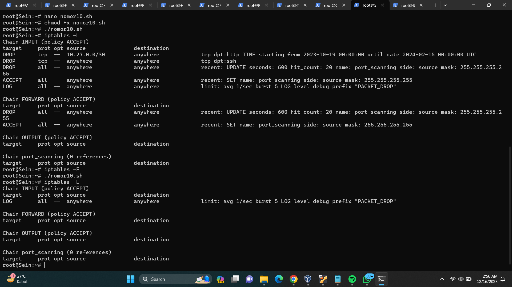
