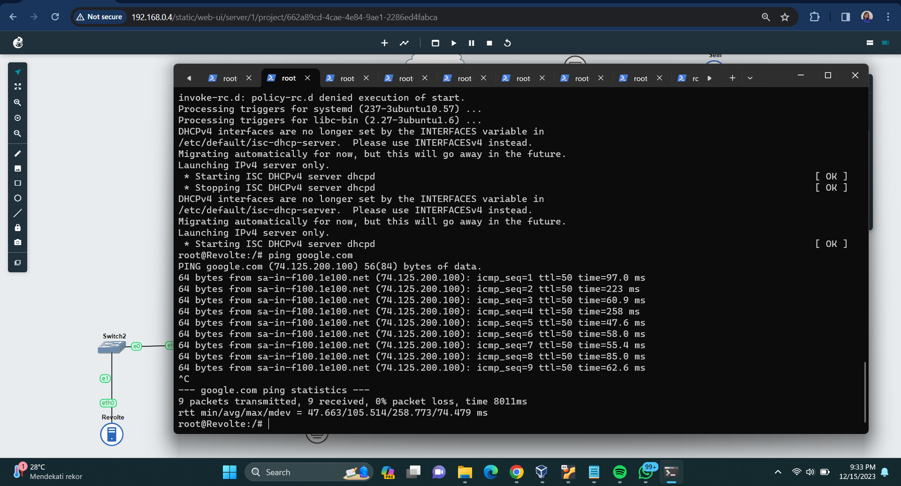

# Jarkom-Modul-5-D11-2023

| Nama                              | NRP        |
| --------------------------------- | ---------- |
| Gracetriana Survinta Septinaputri | 5025211199 |
| Muhammad Rifqi Fadhilah           | 5025211228 |

- [Soal 0](#soal-0)
  - [Topologi](#topologi)
  - [VLSM TREE](#vlsm-tree)
  - [Configuration](#configuration)
- [Soal 1](#soal-1)
- [Soal 2](#soal-2)
- [Soal 3](#soal-3)
- [Soal 4](#soal-4)
- [Soal 5](#soal-5)
- [Soal 6](#soal-6)
- [Soal 7](#soal-7)
- [Soal 8](#soal-8)
- [Soal 9](#soal-9)
- [Soal 10](#soal-10)

## SOAL 0

### Topologi


### VLSM TREE

#### Pembagian subnet :


#### Tree :


#### Pembagian IP :

| Nama Subnet | Rute                                    | Network ID  | Netmask         | Broadcast    |
| ----------- | --------------------------------------- | ----------- | --------------- | ------------ | --- |
| A1          | Fern-Switch2-Revolte                    | 10.27.0.0   | 255.255.255.252 | 10.27.0.3    |     |
| A2          | Fern-Richter                            | 10.27.0.4   | 255.255.255.252 | 10.27.0.7    |     |
| A3          | Himmel-Switch1-SchwerMountain           | 10.27.0.128 | 255.255.255.128 | 10.27.0.255  |     |
| A4          | Himmel-LaubHills                        | 10.27.2.0   | 255.255.254.0   | 10.27.3.255  |     |
| A5          | Frieren-Himmel                          | 10.27.0.8   | 255.255.255.252 | 10.27.0.11   |
| A6          | Frieren-Stark                           | 10.27.0.12  | 255.255.255.252 | 10.27.0.15   |     |
| A7          | Aura-Frieren                            | 10.27.0.16  | 255.255.255.252 | 10.27.0.19   |
| A8          | Aura-Heiter                             | 10.27.0.20  | 255.255.255.252 | 10.27.0.23   |
| A9          | Heiter-TurkRegion                       | 10.27.8.0   | 255.255.248.0   | 10.27.15.255 |
| A10         | Heiter-Switch3-Sein-Switch3-GrobeForest | 10.27.4.0   | 255.255.252.0   | 10.27.7.255  |

### Configuration

#### STATIC IP

- Aura

```
auto eth0
iface eth0 inet dhcp

auto eth1
iface eth1 inet static
	address 10.27.0.21
	netmask 255.255.255.252

auto eth2
iface eth2 inet static
	address 10.27.0.17
	netmask 255.255.255.252

up route add -net 10.27.8.0 netmask 255.255.248.0 gw 10.27.0.22
up route add -net 10.27.4.0 netmask 255.255.252.0 gw 10.27.0.22
up route add -net 10.27.0.12 netmask 255.255.255.252 gw 10.27.0.18
up route add -net 10.27.0.8 netmask 255.255.255.252 gw 10.27.0.18
up route add -net 10.27.2.0 netmask 255.255.254.0 gw 10.27.0.18
up route add -net 10.27.0.128 netmask 255.255.255.128 gw 10.27.0.18
up route add -net 10.27.0.4 netmask 255.255.255.252 gw 10.27.0.18
up route add -net 10.27.0.0 netmask 255.255.255.252 gw 10.27.0.18
```

- Frieren

```
auto eth0
iface eth0 inet static
	address 10.27.0.18
	netmask 255.255.255.252
	gateway 10.27.0.17

auto eth1
iface eth1 inet static
	address 10.27.0.13
	netmask 255.255.255.252

auto eth2
iface eth2 inet static
	address 10.27.0.9
	netmask 255.255.255.252

up route add -net 10.27.0.128 netmask 255.255.255.128 gw 10.27.0.10
up route add -net 10.27.2.0 netmask 255.255.254.0 gw 10.27.0.10
up route add -net 10.27.0.4 netmask 255.255.255.252 gw 10.27.0.10
up route add -net 10.27.0.0 netmask 255.255.255.252 gw 10.27.0.10
```

- Himmel

```
auto eth0
iface eth0 inet static
	address 10.27.0.10
	netmask 255.255.255.252
	gateway 10.27.0.9

auto eth1
iface eth1 inet static
	address 10.27.2.1
	netmask 255.255.254.0

auto eth2
iface eth2 inet static
	address 10.27.0.129
	netmask 255.255.255.128

up route add -net 10.27.0.4 netmask 255.255.255.252 gw 10.27.0.131
up route add -net 10.27.0.0 netmask 255.255.255.252 gw 10.27.0.131
```

- Fern

```
auto eth0
iface eth0 inet static
	address 10.27.0.131
	netmask 255.255.255.128
	gateway 10.27.0.129

auto eth1
iface eth1 inet static
	address 10.27.0.5
	netmask 255.255.255.252

auto eth2
iface eth2 inet static
	address 10.27.0.1
	netmask 255.255.255.252
```

- Heiter

```
auto eth0
iface eth0 inet static
	address 10.27.0.22
	netmask 255.255.255.252
	gateway 10.27.0.21

auto eth1
iface eth1 inet static
	address 10.27.8.1
	netmask 255.255.248.0

auto eth2
iface eth2 inet static
	address 10.27.4.1
	netmask 255.255.252.0
```

- Sein

```
auto eth0
iface eth0 inet static
	address 10.27.4.2
	netmask 255.255.252.0
	gateway 10.27.4.1
```

- Stark

```
auto eth0
iface eth0 inet static
	address 10.27.0.14
	netmask 255.255.255.252
	gateway 10.27.0.13
```

#### DYNAMIC IP (DHCP)

Untuk subnet yang memiliki node client menggunakan bantuan DHCP untuk pembagian IP. Pada semua node client diatur konfigurasinya seperti berikut

```
auto eth0
iface eth0 inet dhcp
```

Pada DHCP SERVER `Revolte` dilakukan konfigurasi di `.bashrc` untuk mengatur DHCP

- Revolte

```
echo ‘INTERFACESv4="eth0"’ > /etc/default/isc-dhcp-server

echo ‘#A1
subnet 10.27.0.0 netmask 255.255.255.252 {
}

#A2
subnet 10.27.0.4 netmask 255.255.255.252 {
}

#A3
subnet 10.27.0.128 netmask 255.255.255.128 {
    range 10.27.0.132 10.27.0.254;
    option routers 10.27.0.129;
    option broadcast-address 10.27.0.255;
    option domain-name-servers 10.27.0.6;
    default-lease-time 600;
    max-lease-time 7200;
}

#A4
subnet 10.27.2.0 netmask 255.255.254.0 {
    range 10.27.2.3 10.27.3.254;
    option routers 10.27.2.1;
    option broadcast-address 10.27.3.255;
    option domain-name-servers 10.27.0.6;
    default-lease-time 600;
    max-lease-time 7200;
}

#A5
subnet 10.27.0.8 netmask 255.255.255.252 {
}

#A6
subnet 10.27.0.12 netmask 255.255.255.252 {
}

#A7
subnet 10.27.0.16 netmask 255.255.255.252 {
}

#A8
subnet 10.27.0.20 netmask 255.255.255.252 {
}

#A9
subnet 10.27.8.0 netmask 255.255.248.0 {
    range 10.27.8.3 10.27.15.254;
    option routers 10.27.8.1;
    option broadcast-address 10.27.15.255;
    option domain-name-servers 10.27.0.6;
    default-lease-time 600;
    max-lease-time 7200;
}

#A10
subnet 10.27.4.0 netmask 255.255.252.0 {
    range 10.27.4.3 10.27.7.254;
    option routers 10.27.4.1;
    option broadcast-address 10.27.7.255;
    option domain-name-servers 10.27.0.6;
    default-lease-time 600;
    max-lease-time 7200;
}’>  /etc/dhcp/dhcpd.conf

service isc-dhcp-server restart
```

Karena setiap router berperan sebagai DHCP relay, maka lakukan konfigurasi DHCP di `.bashrc` semua router. Berikut adalah contoh konfigurasi pada `Fern`.

```
apt-get update
apt-get install isc-dhcp-relay -y

echo 'SERVERS="10.27.0.2"
INTERFACES="eth0 eth1 eth2"' > /etc/default/isc-dhcp-relay

echo 'net.ipv4.ip_forward=1' > /etc/sysctl.conf

service isc-dhcp-relay restart
```

## SOAL 1

Agar topologi yang kalian buat dapat mengakses keluar, kalian diminta untuk mengkonfigurasi Aura menggunakan iptables, tetapi tidak ingin menggunakan MASQUERADE.

### Answer

Menjalankan shell script yang berisi command

```
ETH0_IP=$(ip -4 addr show eth0 | grep -oP '(?<=inet\s)\d+(\.\d+){3}')

iptables -t nat -A POSTROUTING -o eth0 -j SNAT --to-source $ETH0_IP
```

Berikut penjelasan dari script :

- `ip -4 addr show eth0` : mendapatkan informasi tentang alamat IPv4 yang diassign ke eth0.
- `grep -oP` : mengambil alamat IPv4 dari output.
- `(?<=inet\s)` : memeriksa pola `inet` yang diikuti spasi/whitespaces sebelum alamat IP.
- `\d+` : mewakili segmen pertama dari alamat IP.
- `(\.\d+){3}` : meencari pola dengan titik dan satu atau lebih digit dan diulang tiga kali sehingga mewakili tiga segmen terakhir dari alamat IP.
- `iptables -t nat` : mengonfigurasi aturan packet filter iptables dan mengidentifikasi table NAT.
- `-A POSTROUTING` : menambahkan rules ke POSTROUTING chain.
- `-o eth0` : menentukan outbound network interface sebagai eth0.
- `-j SNAT --to-source $ETH0_IP` : menggunakan rules SNAT yang mengubah alamat IP sumber paket kemudian menentukan alamat IP sumber baru yang nilainya diambil dari variabel `ETH0_IP` sebelumnya.

### Testing

Lakukan `ping google.com` untuk testing apakah topologi sudah bisa akses keluar. Berikut contoh testing yang dilakukan di node `Revolte`



## SOAL 2
